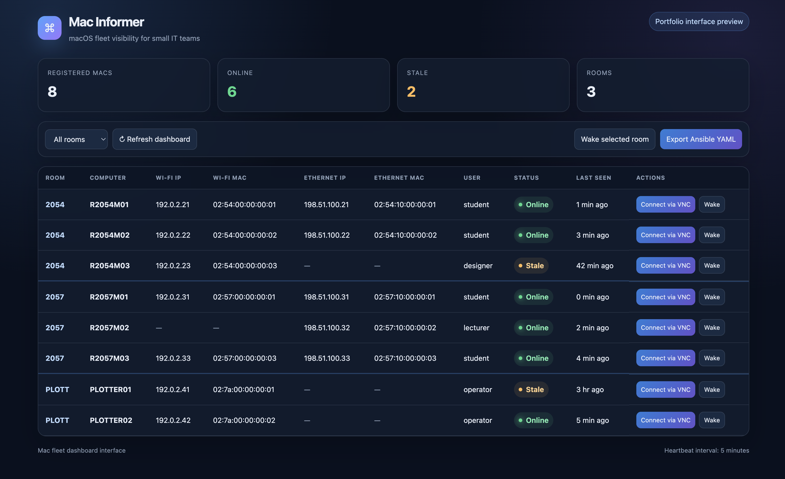

# Mac Informer

> **A lightweight macOS inventory and remote-support dashboard for managed environments.**

Mac Informer helps IT teams track and support managed Macs across changing DHCP leases and multiple VLANs, especially where macOS devices are not always reliably discoverable through Active Directory-integrated DNS.

Each Mac securely reports its current device, user, network, and availability data to a central server over HTTPS using bearer-token authentication.

## Key Features

- Current Wi-Fi and Ethernet IP / MAC addresses
- Computer name, console user, and last-seen status
- Online / stale availability tracking
- Automatic grouping by room or hostname pattern
- Quick VNC / macOS Screen Sharing access
- Wake-on-LAN for individual Macs or groups
- Ansible-compatible YAML inventory export
- Automatic client and server startup with macOS LaunchDaemons
- HTTPS through Caddy with an internal certificate authority

## Dashboard



## Architecture

```text
Managed macOS clients
        |
        | HTTPS heartbeat
        v
Caddy reverse proxy
        |
        v
Python 3 HTTP server
        |
        v
SQLite inventory database
        |
        v
Server-rendered dashboard
```

The reporting flow is client-initiated, so no inbound connection to managed Macs is required for inventory updates.

## Security

Mac Informer uses:

- bearer-token authentication for client heartbeats;
- password protection for the dashboard;
- HTTPS on TCP 443;
- a Python service bound to localhost behind Caddy;
- root-protected server configuration.

Operational databases, credentials, certificates, host lists, and deployment payloads are excluded from the public repository.

## Tech Stack

### Core

- Zsh / shell scripting — macOS client reporting, installation, and automation
- Python 3 standard library — lightweight HTTP server and dashboard backend
- SQLite — local device inventory database
- HTML / CSS — server-rendered dashboard interface
- macOS LaunchDaemons — automatic startup and recurring reporting
- Caddy — HTTPS reverse proxy and internal certificate authority

### Integrations

- VNC / macOS Screen Sharing
- Wake-on-LAN
- Ansible-compatible YAML inventory export

## Use Case

Designed for managed macOS environments where devices may move between networks, receive new DHCP addresses, or sit across VLANs where DNS visibility is incomplete or unreliable.

Mac Informer provides a single place to identify the current machine state and quickly move from inventory to remote support or automation.
